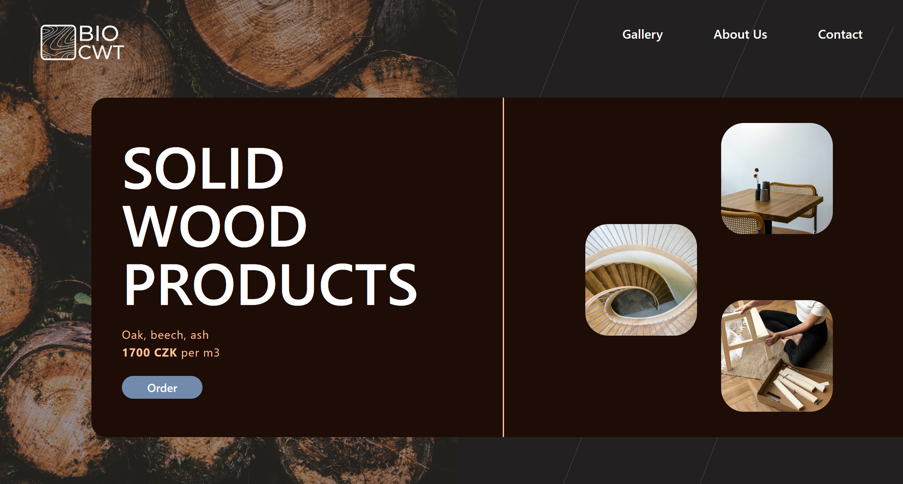

# BIOCWT "SOLID WOOD PRODUCTS" Website

BIOCWT is a sleek, frontend website showcasing premium solid wood products. Built with modern web technologies, it provides a smooth and interactive browsing experience, featuring GSAP for dynamic animations.



## Features

- **Product Display**: A clean and simple interface to explore solid wood furniture and products.
- **GSAP Animations**: Smooth animations to enhance the visual appeal and interactions on the website.

> **Note:** This project is best viewed on desktop devices due to its animations and layout.

## Tech Stack

- **Vite**: For fast development and build tooling.
- **React.js**: For building the user interface.
- **Tailwind CSS**: For styling.
- **GSAP**: For adding animations to enhance the user experience.

## Installation

Follow these steps to run the project locally:

1. **Clone the repository**:
   ```bash
   git clone https://github.com/gauravshresthaofficial/biocwt
   cd biocwt

2. **Install dependencies**:
   ```bash
   npm install

3. **Run the development server**:
   ```bash
   npm run dev

4. **Open your browser and visit the development server link displayed in the terminal (usually http://localhost:5173).**:

## Live View 
https://biocwt-gaurav-shresthas-projects.vercel.app/
